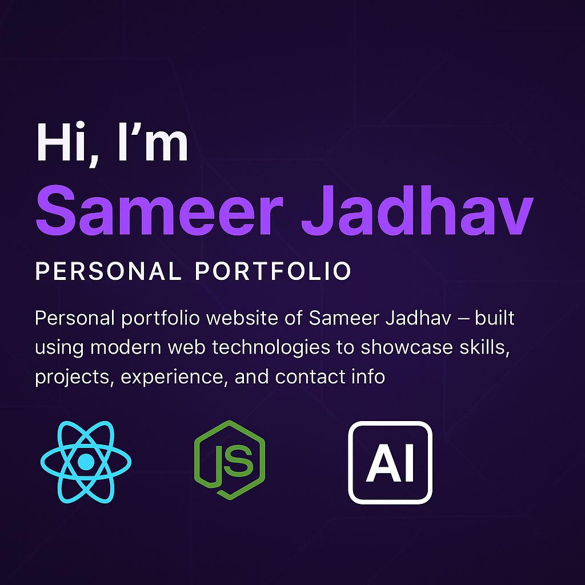

# 🚀 Sameer's Modern Portfolio Website

<p align="center">
  
</p>

A cutting-edge, full-stack portfolio website featuring an intelligent AI chat assistant, modern animations, and responsive design. Built with React, TypeScript, and powered by local AI models.

<div align="center">
  <video width="100%" autoplay loop muted playsinline>
    <source src="src/components/assets/Preview.mp4" type="video/mp4">
    Your browser does not support the video tag.
  </video>
</div>


## 📋 Table of Contents

- [🎯 Overview](#-overview)
- [✨ Features](#-features)
- [🛠️ Technology Stack](#️-technology-stack)
- [🚀 Live Demo](#-live-demo)
- [📸 Screenshots](#-screenshots)
- [⚡ Quick Start](#-quick-start)
- [🔧 Installation](#-installation)
- [🏗️ Project Structure](#️-project-structure)
- [🤖 AI Chat Assistant](#-ai-chat-assistant)
- [🌐 API Endpoints](#-api-endpoints)
- [🚀 Deployment](#-deployment)
- [🧪 Testing](#-testing)
- [📝 Contributing](#-contributing)
- [📄 License](#-license)

## 🎯 Overview

This is a modern, responsive portfolio website that showcases Sameer's skills, projects, and achievements. The portfolio features an intelligent AI chat assistant powered by local Ollama models, providing visitors with an interactive way to learn about Sameer's work and experience.

### Key Highlights

- **🎨 Modern UI/UX**: Beautiful, responsive design with dark/light mode
- **🤖 AI-Powered Chat**: Intelligent assistant with multilingual support
- **⚡ Performance**: Built with Vite for lightning-fast development and builds
- **🔒 Privacy-First**: Local AI processing with no data storage
- **📱 Mobile-First**: Fully responsive across all devices
- **🎭 Smooth Animations**: Engaging user experience with Framer Motion

## ✨ Features

### 🎨 Frontend Features
- **Responsive Design**: Optimized for desktop, tablet, and mobile devices
- **Dark/Light Mode**: Toggle between themes with smooth transitions
- **Interactive Animations**: Smooth scroll animations and micro-interactions
- **Particle Background**: Dynamic particle effects using React Particles
- **Component-Based Architecture**: Modular, reusable React components
- **TypeScript**: Full type safety and better development experience
- **Form Validation**: Robust contact form with React Hook Form

### 🤖 AI Chat Assistant
- **Multilingual Support**: Chat in English, Hindi, or Marathi
- **Portfolio Knowledge**: Ask about skills, projects, and achievements
- **Technical Discussions**: Get information about technologies and development
- **Session Management**: Maintain conversation context
- **Real-time Streaming**: Instant responses with streaming capabilities
- **Multiple AI Personas**: Different conversation styles and expertise

### 🔧 Backend Features
- **Express.js API**: RESTful API with TypeScript
- **Ollama Integration**: Local AI model support
- **MongoDB Integration**: Contact form data storage
- **Rate Limiting**: Protection against abuse
- **CORS Support**: Cross-origin resource sharing
- **Error Handling**: Comprehensive error management
- **Health Checks**: API health monitoring

## 🛠️ Technology Stack

### Frontend Technologies
| Technology | Version | Purpose |
|------------|---------|---------|
| **React** | 18.3.1 | UI Framework |
| **TypeScript** | 5.5.3 | Type Safety |
| **Vite** | 7.0.0 | Build Tool & Dev Server |
| **Tailwind CSS** | 3.4.1 | Utility-First CSS Framework |
| **Framer Motion** | 11.18.2 | Animation Library |
| **React Hook Form** | 7.48.0 | Form Management |
| **Lucide React** | 0.344.0 | Icon Library |
| **React Particles** | 2.12.2 | Particle Effects |
| **React Day Picker** | 9.7.0 | Date Picker Component |
| **date-fns** | 3.6.0 | Date Utility Library |

### Backend Technologies
| Technology | Version | Purpose |
|------------|---------|---------|
| **Node.js** | Latest | Runtime Environment |
| **Express.js** | 4.18.2 | Web Framework |
| **TypeScript** | 5.2.2 | Type Safety |
| **Mongoose** | 7.8.7 | MongoDB ODM |
| **Ollama** | Latest | Local AI Models |
| **CORS** | 2.8.5 | Cross-Origin Support |
| **Axios** | 1.10.0 | HTTP Client |

### Development Tools
| Tool | Purpose |
|------|---------|
| **ESLint** | Code Linting |
| **PostCSS** | CSS Processing |
| **Autoprefixer** | CSS Vendor Prefixing |
| **Nodemon** | Development Server |
| **ts-node** | TypeScript Execution |

## 🚀 Live Demo

🔗 **[View Live Portfolio](https://your-portfolio-url.com)**

## 📸 Screenshots

*(Add screenshots of your portfolio here)*

## ⚡ Quick Start

### Prerequisites
- Node.js (v16 or higher)
- npm or yarn
- Git

### Clone the Repository
```bash
git clone https://github.com/your-username/Sameer_portfolio.git
cd Sameer_portfolio
```

### Install Dependencies
```bash
# Install frontend dependencies
npm install

# Install backend dependencies
cd backend
npm install
cd ..
```

### Environment Setup
```bash
# Frontend environment
cp frontend-env-template.txt .env

# Backend environment
cd backend
cp ../backend-env-template.txt .env
cd ..
```

### Start Development Servers
```bash
# Start frontend (Terminal 1)
npm run dev

# Start backend (Terminal 2)
cd backend
npm run dev
```

Visit `http://localhost:5173` to view the portfolio!

## 🔧 Installation

### Detailed Setup Instructions

1. **Clone the Repository**
   ```bash
   git clone https://github.com/your-username/Sameer_portfolio.git
   cd Sameer_portfolio
   ```

2. **Install Frontend Dependencies**
   ```bash
   npm install
   ```

3. **Install Backend Dependencies**
   ```bash
   cd backend
   npm install
   cd ..
   ```

4. **Configure Environment Variables**

   **Frontend (.env):**
   ```env
   VITE_BACKEND_URL=http://localhost:5000
   ```

   **Backend (.env):**
   ```env
   PORT=5000
   OLLAMA_BASE_URL=http://localhost:11434
   OLLAMA_MODEL=llama2
   MONGODB_URI=mongodb://localhost:27017/portfolio
   ```

5. **Install Ollama (for AI chat)**
   ```bash
   # Download from https://ollama.ai
   # Or use package manager
   brew install ollama  # macOS
   # or
   curl -fsSL https://ollama.ai/install.sh | sh  # Linux
   ```

6. **Pull AI Model**
   ```bash
   ollama pull llama2
   ```

7. **Start Ollama**
   ```bash
   ollama serve
   ```

### Available Scripts

**Frontend:**
```bash
npm run dev          # Start development server
npm run build        # Build for production
npm run preview      # Preview production build
npm run lint         # Run ESLint
npm run live         # Start with live reload
```

**Backend:**
```bash
npm run dev          # Start development server
npm run build        # Build TypeScript
npm start            # Start production server
npm run test:ollama  # Test Ollama integration
npm run test:mongodb # Test MongoDB connection
```

## 🏗️ Project Structure

```
Sameer_portfolio/
├── 📁 src/                          # Frontend source code
│   ├── 📁 components/               # React components
│   │   ├── 📁 assets/              # Images and static files
│   │   ├── About.tsx               # About section
│   │   ├── Achievements.tsx        # Achievements showcase
│   │   ├── AnimatedText.tsx        # Animated text component
│   │   ├── BookAppointment.tsx     # Appointment booking
│   │   ├── Contact.tsx             # Contact form
│   │   ├── Counter.tsx             # Statistics counter
│   │   ├── Experience.tsx          # Work experience
│   │   ├── Footer.tsx              # Footer component
│   │   ├── Hero.tsx                # Hero section
│   │   ├── Navbar.tsx              # Navigation bar
│   │   ├── Portfolio.tsx           # Project showcase
│   │   ├── Skills.tsx              # Skills section
│   │   ├── SocialHandles.tsx       # Social media links
│   │   └── ThemeToggle.tsx         # Theme switcher
│   ├── 📁 config/                  # Configuration files
│   ├── 📁 hooks/                   # Custom React hooks
│   ├── 📁 types/                   # TypeScript type definitions
│   ├── 📁 utils/                   # Utility functions
│   ├── App.tsx                     # Main App component
│   ├── index.css                   # Global styles
│   └── main.tsx                    # Application entry point
├── 📁 backend/                     # Backend source code
│   ├── 📁 src/
│   │   ├── 📁 config/              # Configuration files
│   │   ├── 📁 controllers/         # Route controllers
│   │   ├── 📁 models/              # Database models
│   │   ├── 📁 routes/              # API routes
│   │   ├── 📁 services/            # Business logic
│   │   ├── 📁 utils/               # Utility functions
│   │   ├── app.ts                  # Express app setup
│   │   ├── db.ts                   # Database connection
│   │   └── server.ts               # Server entry point
│   ├── package.json                # Backend dependencies
│   └── tsconfig.json               # TypeScript config
├── 📁 public/                      # Static assets
├── package.json                    # Frontend dependencies
├── vite.config.ts                  # Vite configuration
├── tailwind.config.js              # Tailwind CSS config
└── tsconfig.json                   # TypeScript config
```

## 🤖 AI Chat Assistant

The portfolio features an intelligent AI assistant powered by local Ollama models, providing visitors with an interactive way to learn about Sameer's work and experience.

### Features
- **🎯 Portfolio Knowledge**: Deep understanding of Sameer's skills, projects, and achievements
- **🌍 Multilingual Support**: Chat in English, Hindi, or Marathi
- **💬 Context Awareness**: Maintains conversation context across messages
- **⚡ Real-time Responses**: Instant streaming responses
- **🔒 Privacy-First**: No data storage, local AI processing
- **🎭 Multiple Personas**: Different conversation styles and expertise

### Available AI Contexts

1. **Portfolio Assistant** (Default)
   - Knowledge about Sameer's skills and projects
   - Best for portfolio visitors

2. **Technical Expert**
   - Deep technical discussions
   - Programming and development topics

3. **Casual Chat**
   - Friendly, casual conversations
   - General social interaction

4. **Creative Assistant**
   - Creative projects and brainstorming
   - Innovative thinking

### Usage
1. Click the "Chat with Sam AI" button
2. Accept the privacy policy
3. Select your preferred language
4. Start chatting about Sameer's portfolio

## 🌐 API Endpoints

### Chat Endpoints
- `POST /api/chat` - Send chat message
- `POST /api/chat/stream` - Stream chat responses
- `GET /api/chat/models` - Get available AI models
- `GET /api/chat/health` - Check AI service health

### Session Management
- `GET /api/chat/session/:sessionId` - Get session context
- `DELETE /api/chat/session/:sessionId` - Clear session

### Context Management
- `GET /api/contexts` - Get available AI contexts
- `GET /api/contexts/:contextId` - Get specific context

### Contact Form
- `POST /api/contact` - Submit contact form

### Ngrok Integration
- `GET /api/ngrok/status` - Check ngrok status
- `POST /api/ngrok/start` - Start ngrok tunnel

## 🚀 Deployment

### Frontend Deployment (Vercel)

1. **Connect to Vercel**
   ```bash
   npm install -g vercel
   vercel login
   vercel
   ```

2. **Configure Environment Variables**
   - `VITE_BACKEND_URL`: Your backend deployment URL

3. **Deploy**
   ```bash
   vercel --prod
   ```

### Backend Deployment (Railway)

1. **Install Railway CLI**
   ```bash
   npm install -g @railway/cli
   ```

2. **Deploy to Railway**
   ```bash
   cd backend
   railway login
   railway init
   railway up
   ```

3. **Configure Environment Variables**
   ```env
   OLLAMA_BASE_URL=https://your-ollama-instance.railway.app
   OLLAMA_MODEL=llama2
   PORT=5000
   MONGODB_URI=your-mongodb-uri
   ```

### Alternative Deployment Options

- **Render**: Web service deployment
- **Heroku**: Container deployment
- **DigitalOcean**: App Platform
- **AWS**: EC2 or Lambda deployment

## 🧪 Testing

### Frontend Testing
```bash
# Run linting
npm run lint

# Build test
npm run build
npm run preview
```

### Backend Testing
```bash
cd backend

# Test Ollama integration
npm run test:ollama

# Test MongoDB connection
npm run test:mongodb

# Test ngrok monitoring
npm run test:ngrok
```

### Manual Testing
1. **Frontend**: Visit `http://localhost:5173`
2. **Backend**: Test API endpoints with Postman or curl
3. **AI Chat**: Test chat functionality
4. **Contact Form**: Submit test messages
5. **Responsive Design**: Test on different screen sizes

## 📝 Contributing

We welcome contributions! Please follow these steps:

1. **Fork the repository**
2. **Create a feature branch**
   ```bash
   git checkout -b feature/amazing-feature
   ```
3. **Commit your changes**
   ```bash
   git commit -m 'Add amazing feature'
   ```
4. **Push to the branch**
   ```bash
   git push origin feature/amazing-feature
   ```
5. **Open a Pull Request**

### Development Guidelines
- Follow TypeScript best practices
- Use ESLint for code quality
- Write meaningful commit messages
- Test your changes thoroughly
- Update documentation as needed

## 📄 License

This project is licensed under the MIT License - see the [LICENSE](LICENSE) file for details.

## 🙏 Acknowledgments

- **Ollama Team** for providing local AI models
- **Vite Team** for the amazing build tool
- **Tailwind CSS** for the utility-first CSS framework
- **Framer Motion** for smooth animations
- **React Community** for the excellent ecosystem

## 📞 Contact

- **Portfolio**: [https://your-portfolio-url.com](https://your-portfolio-url.com)
- **GitHub**: [@your-username](https://github.com/your-username)
- **LinkedIn**: [Sameer Jadhav](https://linkedin.com/in/sameer-jadhav)
- **Email**: sameer@example.com

---

⭐ **Star this repository if you found it helpful!**

*Built with ❤️ by Sameer Jadhav* 